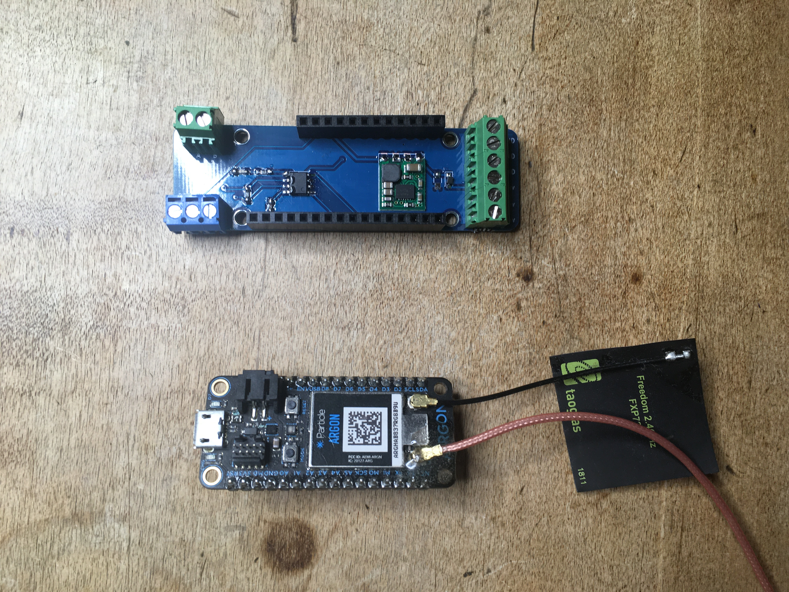
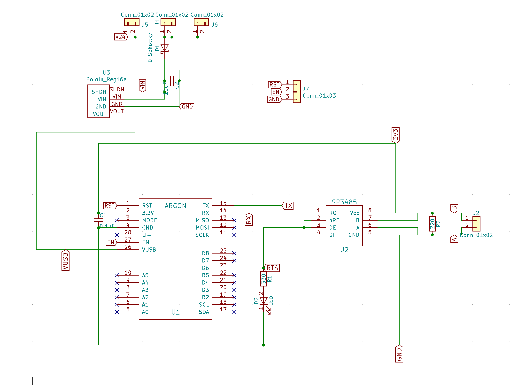
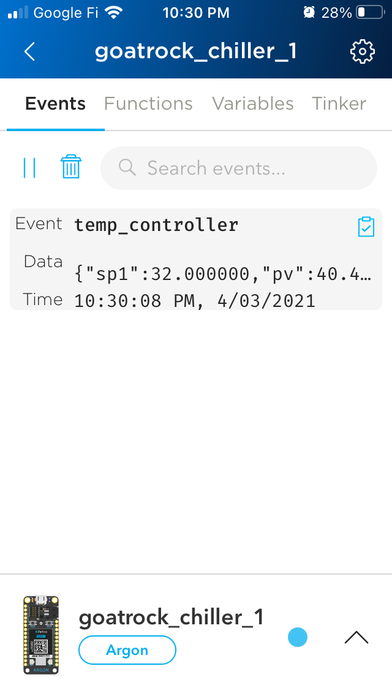
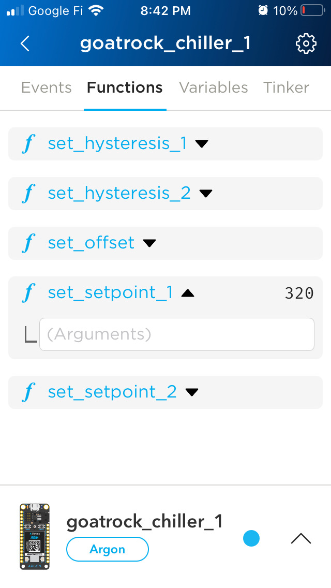

# RS-485-FeatherWing
RS-485 FeatherWing

Can be used with any Feather style microcontroller

Firmware and simple mobile app available for Particle Argon or Boron microcontroller.

Connect your modbus client unit to your phone using the Particle.io mobile app.

Control your chiller or process heat from your phone.

## Use Scenario

* RS-485 Featherwing ([github](https://github.com/timshac/RS-485-FeatherWing), [tindie](https://www.tindie.com/products/hudsonsonoma/rs-485-modbus-controller-with-mobile-app/))
* Particle Argon or Boron ([purchase](https://store.particle.io/collections/gen-3))

## Building the Hardware

Clone this repository. Use Kicad to edit the circuit board and generate gerbers, or send the existing Gerbers to a fab. I use Seeed Studio.
Use the BOM to order parts.

## Connect hardware

1. Wire the RS-485 Featherwing to your modbus RTU unit.  Connect D1 <-> A and D2 <-> B
Power the RS-485 Featherwing with 5.2-36v DC (200mA)
2. Insert the Boron or Argon into the RS-485 Featherwing
3. Connnect particle Boron (Cellular) or Argon (WiFi) to the Particle cloud using the Particle mobile app: [Android](https://play.google.com/store/apps/details?id=io.particle.android.app), [iOS](https://apps.apple.com/us/app/particle-iot/id991459054)

## Demo Firmware available

Clone this firmware
[Github Novus-N322-modbus-RTU-driver](https://github.com/timshac/Novus-N322-modbus-RTU-driver)
Adapt to your modbus RTU device

## Example Particle.io Mobile App

For the demo firmware

## Let's talk - Office Hours

Are you interested in this system of tools we are building? 

I would love to talk and listen to you!

Please book a free 20 minute session - [Hudson Sonoma Office Hours](https://calendly.com/twbishop/hudson-sonoma-office-hours) - if you would like to talk about any of the following:

* Understanding what this is and why it might be useful for you
* Customizing the firmware or mobile app
* Feedback having used (or tried to use) this product

## License

* Hardware: CERN-OHL-P

This hardware is intended for further engineering and/or development, it is not an end user product. This development product is supplied AS IS, without any warranties, with all faults, at the buyer’s and further users’ sole risk. The user assumes all responsibility and liability for proper and safe operation.

The user understands and agrees that this is not designed for use in safety-critical applications where a failure of the product would reasonably be expected to cause severe personal injury or death.

Any use of this firmware and/or hardware is solely at the customer’s risk, and that customer is solely responsible for compliance with all legal and regulatory requirements in connection with such use.

HARDWARE AND ANY RELATED SOFTWARE IS PROVIDED ‘AS IS’ WITH NO ADDITIONAL WARRANTY.

THERE IS NO OTHER WARRANTY, EXPRESS OR IMPLIED, SUCH AS WARRANTY OF MERCHANTABILITY, FITNESS FOR PARTICULAR PURPOSE OR NON INFRINGEMENT.